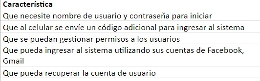
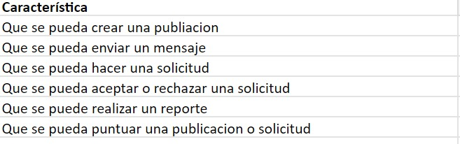
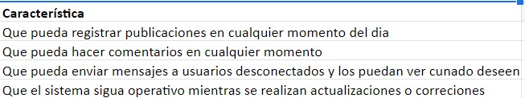
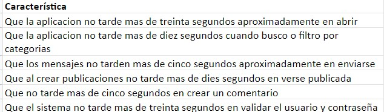

# Drivers Arquitectonicos

### Enlace Atributos de Calidad
[Atributos de Calidad](https://docs.google.com/spreadsheets/d/19BZnZ8DsE1SvXHnfAUn8dCnYpQEulEgI/edit#gid=1357460348)

  - Características y escenarios de calidad
    - Seguridad
			 
			- **Características de los el Atributo de Calidad**
			 
			
			- Enlace a los Escenarios
			- [Seguridad](https://docs.google.com/spreadsheets/d/19BZnZ8DsE1SvXHnfAUn8dCnYpQEulEgI/edit#gid=784533013)
	- Capacidad de ser Administrado

			 
			- **Características de el Atributo de Calidad**
			 
			
			- Enlace de los escensarios
			- [Administrado esenarios](https://docs.google.com/spreadsheets/d/19BZnZ8DsE1SvXHnfAUn8dCnYpQEulEgI/edit#gid=26093161)

	- Confiabilidad
			 
			- **Características de el Atributo de Calidad**
			)
			- Enlace de los escenarios
			- [Confiabilidad](https://docs.google.com/spreadsheets/d/19BZnZ8DsE1SvXHnfAUn8dCnYpQEulEgI/edit#gid=1298871441)
			 

	- Disponibilidad
			 
			- **Características de el Atributo de calidad**
			 
			
			- Enscenarios de los esenarios
			- [Disponibilidad](https://docs.google.com/spreadsheets/d/19BZnZ8DsE1SvXHnfAUn8dCnYpQEulEgI/edit#gid=158668228)
	- Capacidad de ser Soportado
			 
			- **Características el Atributo de calidad**
			 
			 
			- Enlace a los Escenarios
			- [Soportado](https://docs.google.com/spreadsheets/d/19BZnZ8DsE1SvXHnfAUn8dCnYpQEulEgI/edit#gid=158668228)
	

	- Rendimiento
			 
			- **Características de el Atributo de Calidad**
			 
			
			- Enlace a los Escenarios
			- [Rendimiento](https://docs.google.com/spreadsheets/d/19BZnZ8DsE1SvXHnfAUn8dCnYpQEulEgI/edit#gid=339074981)

## Funcionalidades Criticas
- 1. Que los mensajes enviados tanto por interesados como por publicadores lleguen de forma segura y rápida a su destinatario, para así poder concretar el préstamo del servicio.
- 2. Que luego de que los interesados envían las solicitudes para poder acceder a las publicaciones se pueda asegurar que estas solicitudes efectivamente lleguen a sus destinatarios
- 3. Que el usuario que envía el mensaje pueda enterarse cuando el receptor reciba el mensaje
Reto técnico:
- 4. Poder garantizar que los usuarios puedan recibir y enviar tanto solicitudes como mensajes de la manera más efectiva y rápida
 
**Spikes:**
- 1. Yo como usuario deseo recibir mensajes  para poder concretar las prestación de un servicio que requiero

- 2. Yo como usuario deseo poder recibir las solicitudes que me envían para poder concretar con el interesado la prestación de dicho servicio
    - **Criterios de aceptación:**
        - Crear una publicación
        - dentro de los filtros de creación de la publicación, seleccionar que deseo que me envien solicitudes
- 3. yo como cliente, quiero poder visualizar si mis mensajes llegan a su destino y como estos son recibidos por los otros usuarios

## Restricciones Tecnicas
- 1. La buena implementacion del codigo limpio
- 2. Contar con un testeo de código
- 3. Poder realizar pruebas unitarias
- 4. Poder realizar pruebas de aceptación
- 5. Poder realizar pruebas de integración

## Restricciones de Negocio
- 1. No se cuenta con un presupuesto inicial, ni con financiamiento de ningún tipo
- 2. El producto cuenta con una fecha límite establecida para noviembre del 2022

