# Drivers Arquitectonicos

### Enlace Atributos de Calidad
[Atributos de Calidad](https://docs.google.com/spreadsheets/d/19BZnZ8DsE1SvXHnfAUn8dCnYpQEulEgI/edit#gid=1357460348)

  - Características y escenarios de calidad
	- Confiabilidad
			 
			1.Características
			 
			) 
			2. Algunos Escenarios 
				2.1. Escenario de Calidad 1
				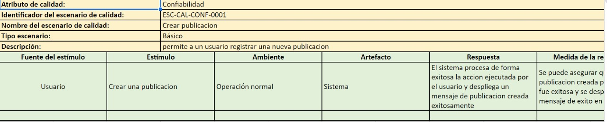
				2.2. Escenario de calidad 2
				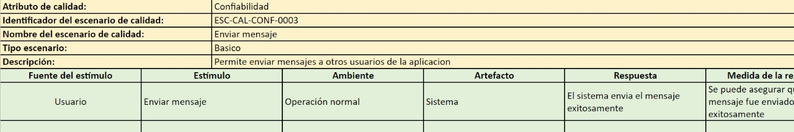
				2.3. Escenario de Calidad 3
				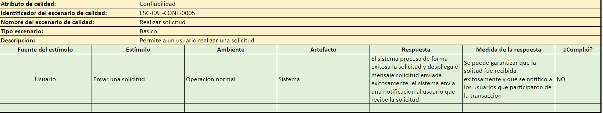
				2.4. Escenario de calidad 4
				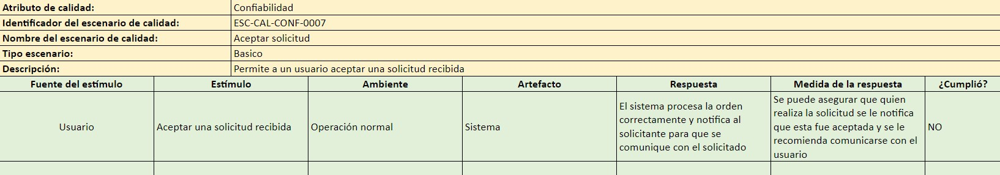
				2.5. Escenario de Calidad 5
				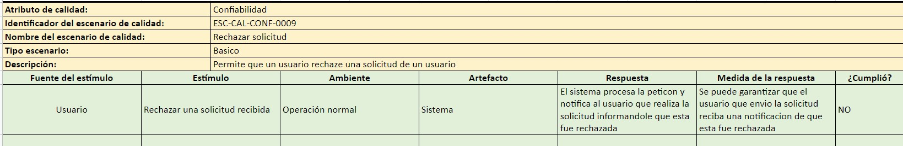
	- Disponibilidad
			 
			1.Características
			 
			 
			2. Algunos Escenarios 
				2.1. Escenario 1
					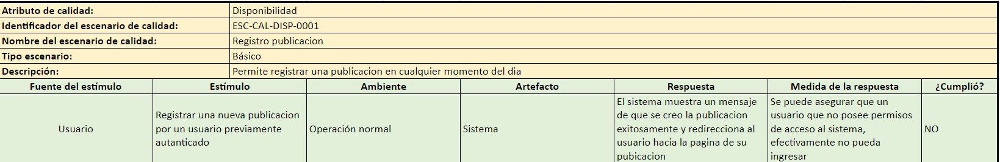
				2.2. Escenario 2
					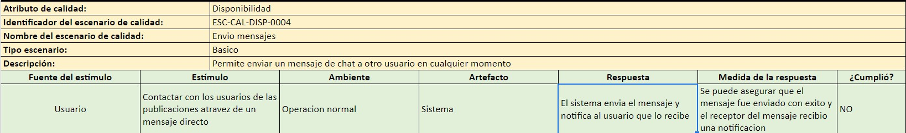
				2.3. Escenario 3
					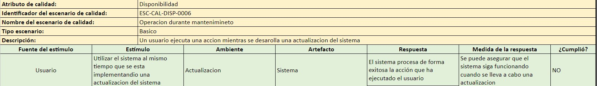
	- Capacidad de ser Soportado
			 
			1.Características
			 
			 
			2.Escenarios 
				2.1. Escenario 1
					
				2.2. Escenario 2
					
	
	- Capacidad de ser Administrado
			 
			1.Características
			 
			
			 
			2.Algunos Escenarios 
				2.1. Escenario 1
					
				2.2. Escenario 2
					
				2.4. Escenario 4
					
                2.5 Escenario 5	
                    
	- Rendimiento
			 
			1.Características
			 
			
			 
			2.Algunos Escenarios 
				2.1. Escenario 1
					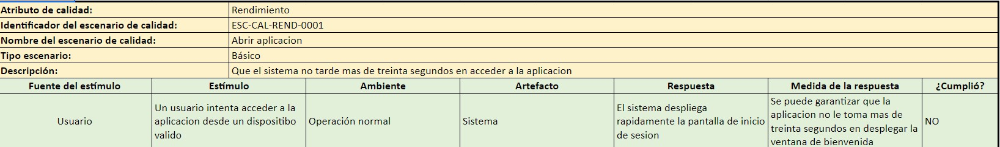
				2.2. Escenario 2
					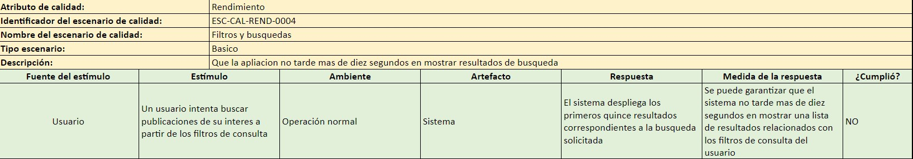
				2.3. Escenario 3
					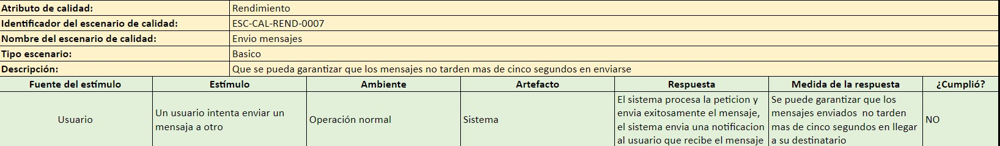
				2.4. Escenario 4
					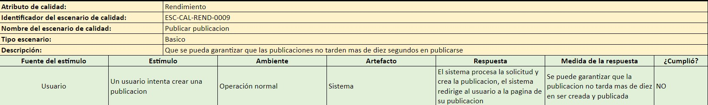	
				2.5. Escenario 5
					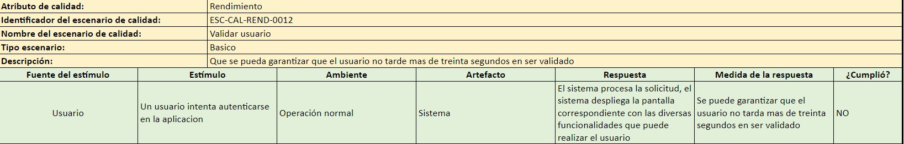

	- Seguridad
			 
			1.Características
			 
			
			 
			2.Algunos Escenarios 
				2.1. Escenario 1
					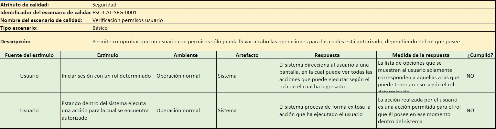
				2.2. Escenario 2
					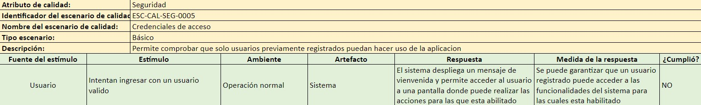
				2.3. Escenario 3
					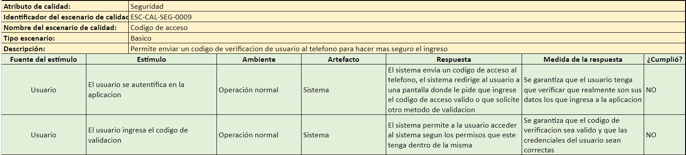
				2.4. Escenario 4
					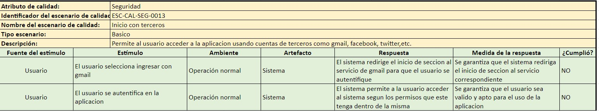	
				2.5. Escenario 5
					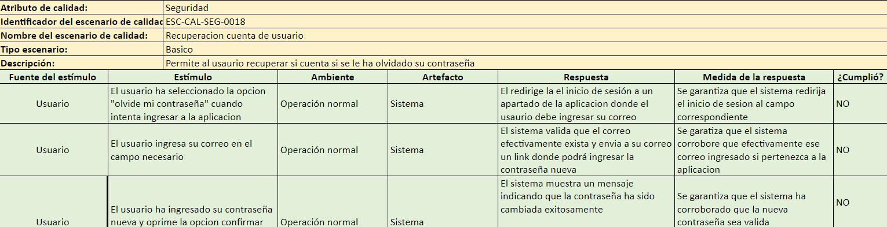

## Funcionalidades Criticas
- 1. Que los mensajes enviados tanto por interesados como por publicadores lleguen de forma segura y rápida a su destinatario, para así poder concretar el préstamo del servicio.
- 2. Que luego de que los interesados envían las solicitudes para poder acceder a las publicaciones se pueda asegurar que estas solicitudes efectivamente lleguen a sus destinatarios
- 3. Que el usuario que envía el mensaje pueda enterarse cuando el receptor reciba el mensaje
Reto técnico:
- 4. Poder garantizar que los usuarios puedan recibir y enviar tanto solicitudes como mensajes de la manera más efectiva y rápida
 
**Spikes:**
- 1. Yo como usuario deseo recibir mensajes  para poder concretar las prestación de un servicio que requiero

- 2. Yo como usuario deseo poder recibir las solicitudes que me envían para poder concretar con el interesado la prestación de dicho servicio
    - **Criterios de aceptación:**
        - Crear una publicación
        - dentro de los filtros de creación de la publicación, seleccionar que deseo que me envien solicitudes
- 3. yo como cliente, quiero poder visualizar si mis mensajes llegan a su destino y como estos son recibidos por los otros usuarios

## Restricciones Tecnicas
- 1. La buena implementacion del codigo limpio
- 2. Contar con un testeo de código
- 3. Poder realizar pruebas unitarias
- 4. Poder realizar pruebas de aceptación
- 5. Poder realizar pruebas de integración

## Restricciones de Negocio
- 1. No se cuenta con un presupuesto inicial, ni con financiamiento de ningún tipo
- 2. El producto cuenta con una fecha límite establecida para noviembre del 2022

