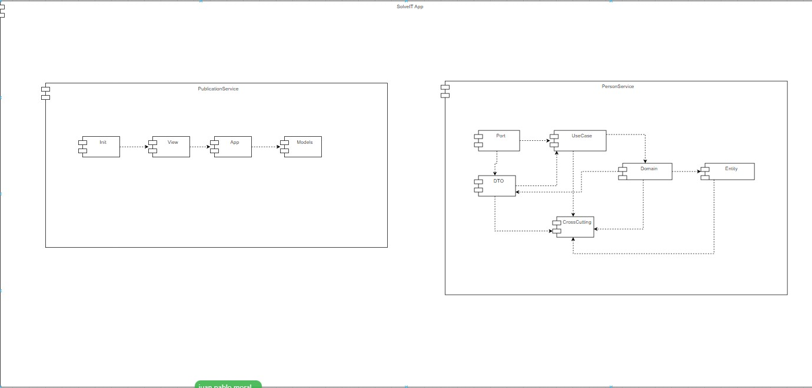
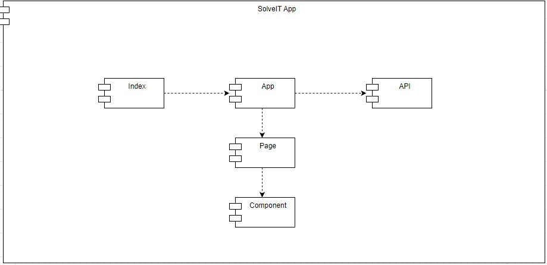

# Modelo de Componentes

### Enlace modelo de componentes Back End
[Modelo Componentes back end](https://app.diagrams.net/#G1qx8ZiP0MNXVSl0NhVqkBulmRBV0RTxTa)

### Imagen Diagrama de Componentes

### Enlace Componentes HTML Back
[compnentes HTML](Componentes(Back).drawio.html)

### Enlace modelo de componentes Front End
[Modelo Componentes](https://app.diagrams.net/#G1Mm0lFrh5rq1EEX4TmNecnTSEi5_Ny9XZ)

### Imagen Diagrama de Componentes Front End

### Enlace HTML Front
[Componentes HTML](Componentes%20(Front).drawio.html)
