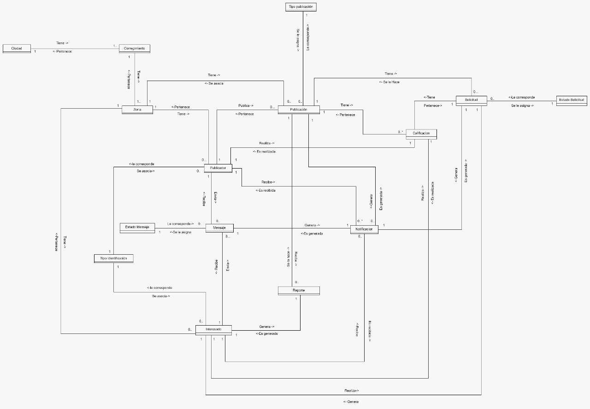

# Modelo de Dominio
## Entidades
- **Ciudad**
    - Entidad que representa las diferentes cuidades donde viven los usuarios que usan la aplicacion
- **Corregimiento**
    - Entidad que representa los diferentes corregimientos asociados a las diferentes ciudades
- **Zona**
    - Entidades que representan los diferentes zonas asociadasd a los corregimientos
- **Tipo Identificacion**
    - Entidad que representa el tipo de identificacion de cada persona segun su procedencia
- **Publicador**
    - Entidad que representa aquel persona que ofrese sus servicios o solicita a alguien para ayudarlo
- **Interesado**
    - Entidad que representa aquel persona que esta interesado en solucionar un problema o esta buscando a alguien que le ayude a solucionar el suyo
- **Publicacion**
    - Entidad que representa las publicaciones que hacen los publicadores y permiten hacer saber a los demas de sus servicios o el problema que tienen
- **Notificación**
    - Entidad que representa las notificaciones que recibe el usuario por algun evento
- **Tipo de Publicacion**
    - Entidad que representa los filtros de servicios que se pueden solocitar o realizar
- **Reporte**
    - Entidad que representa los reportes que un usuario le hace a una publicacion por Motivos de infoconformidad o ilegalidad
- **Calificacion**
    - Entidad que Representa la calificacion que se le hace a una publicacion o solicitud 
- **Solicitud**
    - Entidad que representa las solicitudes que se le hacen a una publicacion 
- **Estado Solicitud**
    -Entidad que representa el estado en el que se encuentra una solicitud
- **Estado Menssaje**
    - Entidad que representa el estado en el que se encuentra un mensaje
- **Mensaje**
    - Entidad que representa los mensajes que envian y reciben los usuarios

### Enlace al Modelo de Dominio
[Modelo](https://app.diagrams.net/#G14tKhf90TesHU4usEeGjvr45pFx9YN2fk)
 
 

### Enlace a la Simulacion De Datos

[Simulacion de Datos](https://docs.google.com/spreadsheets/d/18kCBN3mbheota7gEqgPF2z--vVf4UDZw/edit#gid=1857676797)
 
 

### Imagen  Modelo de Dominio
